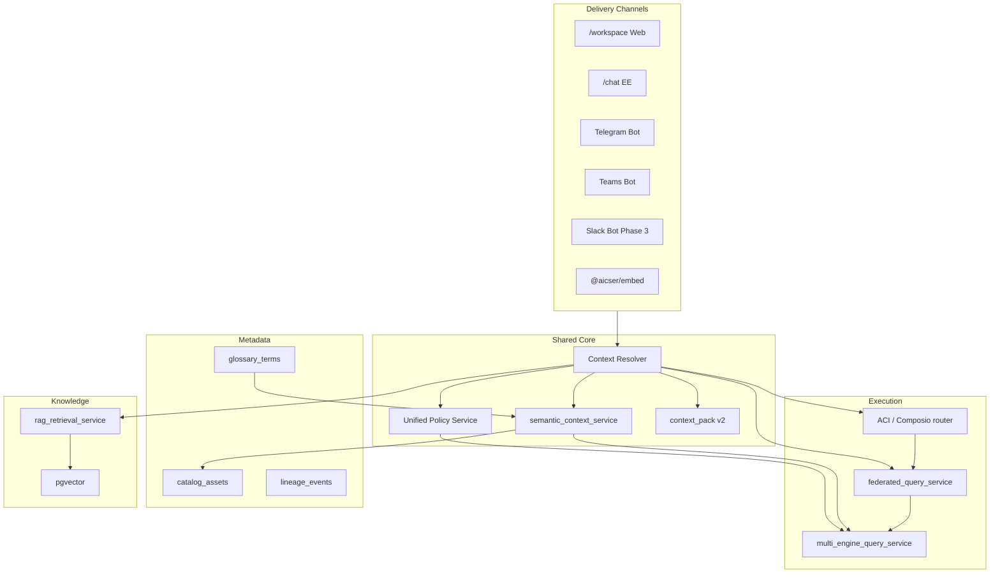
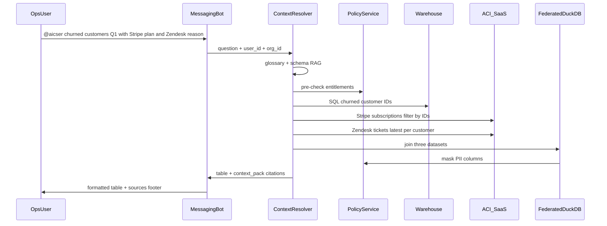
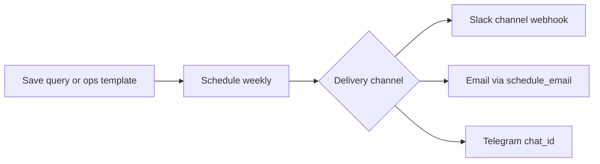
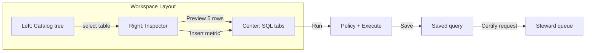
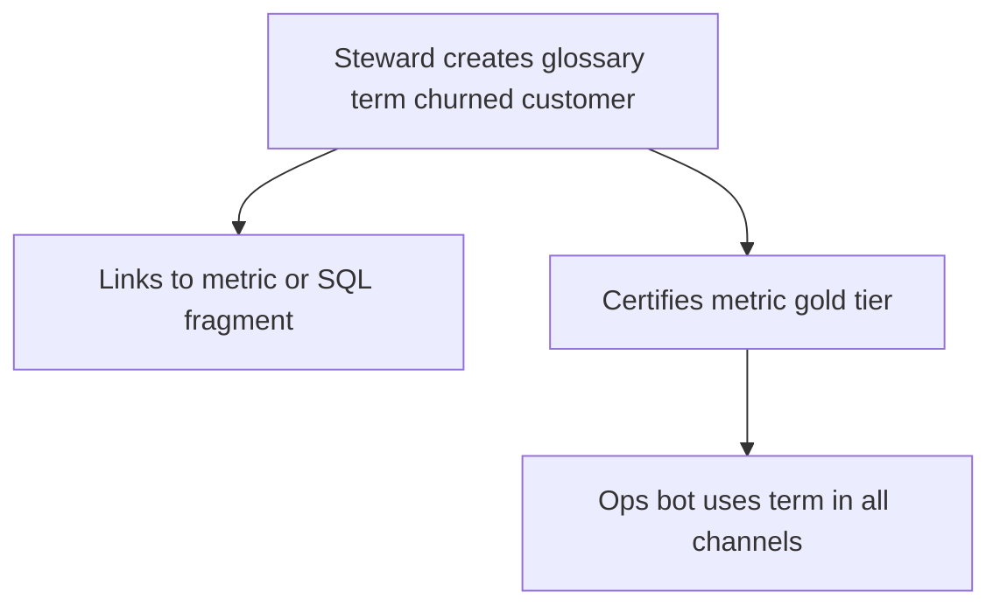
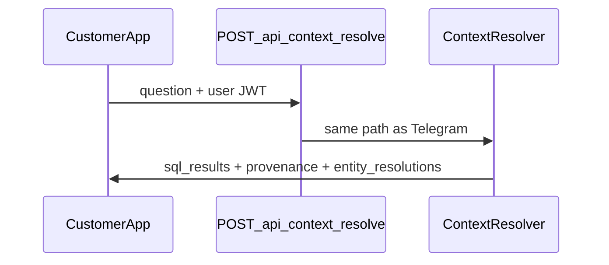

# Aicser Platform PRD

**Unified Analyst Workspace · AI Context Engine · Ops Request Dispatcher**


| Field            | Value                                                                                                                                                               |
| ---------------- | ------------------------------------------------------------------------------------------------------------------------------------------------------------------- |
| **Status**       | Draft — validated against codebase (June 2026)                                                                                                                      |
| **Audience**     | Product, engineering, enterprise sales, OSS community                                                                                                               |
| **Related docs** | [AGENTS.md](../AGENTS.md) · [PLATFORM_AUDIT.md](../PLATFORM_AUDIT.md) · [CONTRIBUTING.md](../CONTRIBUTING.md) · [server/ARCHITECTURE.md](../server/ARCHITECTURE.md) |


---

## Table of contents

1. [Executive summary](#1-executive-summary)
2. [Problem statement](#2-problem-statement)
3. [Product vision & positioning](#3-product-vision--positioning)
4. [Product pillars](#4-product-pillars)
5. [Current platform audit](#5-current-platform-audit)
6. [Consolidation principles (no duplication)](#6-consolidation-principles-no-duplication)
7. [Target architecture](#7-target-architecture)
8. [User flows & experience](#8-user-flows--experience)
9. [Functional requirements](#9-functional-requirements)
10. [Non-functional requirements](#10-non-functional-requirements)
11. [CE vs EE strategy](#11-ce-vs-ee-strategy)
12. [Phased roadmap](#12-phased-roadmap)
13. [API & data contracts](#13-api--data-contracts)
14. [Industry standards & competitive posture](#14-industry-standards--competitive-posture)
15. [Risks & mitigations](#15-risks--mitigations)
16. [Success metrics](#16-success-metrics)
17. [Out of scope](#17-out-of-scope)
18. [Open decisions](#18-open-decisions)
19. [Appendices](#19-appendices)

---

## 1. Executive summary

### 1.1 What Aicser is building

Aicser is an open-source, self-hostable **data-to-AI platform** with three integrated pillars:


| Pillar                        | One-line definition                                                                                                   | Primary users                      |
| ----------------------------- | --------------------------------------------------------------------------------------------------------------------- | ---------------------------------- |
| **Unified Analyst Workspace** | One web environment to discover data, query with SQL, define metrics once, govern access, collaborate, and publish    | Data analysts, analytics engineers |
| **AI Context Engine**         | Governed context-as-a-service: natural-language questions → structured SQL, documents, entity mappings, and citations | AI engineers, platform teams       |
| **Ops Request Dispatcher**    | Instant answers to ad-hoc operational data questions in Slack, Teams, and Telegram—without SQL or backlog wait        | RevOps, CS, Support, business ops  |


These pillars share **one semantic layer**, **one policy pipeline**, **one query execution path**, and **one context contract**. They are not three products with three backends.

### 1.2 Why this matters

- Analysts spend 40–60% of their time switching tools and reconciling metric definitions.
- Ops teams flood data teams with repetitive list-and-join requests (“churned customers + Stripe plan + Zendesk reason”).
- AI copilots fail in production because context is ungoverned, entities are ambiguous, and agents run with super-user credentials.

Aicser closes these gaps on the customer’s infrastructure—without mandating a single warehouse, catalog vendor, or paid unified-API middleware.

### 1.3 Strategic thesis


| Principle                                  | Implication                                                                                                               |
| ------------------------------------------ | ------------------------------------------------------------------------------------------------------------------------- |
| **Integrate, don’t rebuild**               | Reuse Monaco SQL editor, LangGraph analyze, semantic APIs, feed, federated query, ACI/Composio integrations, Telegram bot |
| **One backend, many channels**             | Web workspace, chat, and messaging bots call the same Context Resolver                                                    |
| **Governance at execute time**             | Policy, RLS, and masking apply in `multi_engine_query_service`—not only at the LLM boundary                               |
| **Native catalog first**                   | `platform/catalog_assets` is source of truth; OpenMetadata/DataHub are optional connectors                                |
| **License-safe SaaS access**               | ACI.dev + Composio (Apache 2.0)—not raw SaaS API sprawl or mandatory Merge.dev                                            |
| **Simple for ops, powerful for engineers** | Ops asks in plain English; engineers define semantics and policies once                                                   |


### 1.4 Delivery sequence

```text
Phase 0  Platform integrity (policy at execute, auth gaps, Teams router, semantic consolidation)
Phase 1  Analyst Workspace MVP + messaging channel hardening (Telegram reference, Teams fix)
Phase 2  Governance-by-default (certification, glossary, freshness, ops term definitions)
Phase 3  Context Engine productization (REST API, SDK, Slack @mention bot, scheduled ops reports)
Phase 4  Enterprise scale (OM sync jobs, Trino connector, federated catalog, ERP entity packs)
```

Dashboard widget depth remains a **parallel track** in [PLATFORM_AUDIT.md](../PLATFORM_AUDIT.md).

---

## 2. Problem statement

### 2.1 Analyst & engineering pain


| Pain                     | Root cause                                           | Impact                                         |
| ------------------------ | ---------------------------------------------------- | ---------------------------------------------- |
| Definition fragmentation | Metrics differ across dbt, BI, notebooks, ad-hoc SQL | “Numbers never match”; trust loss              |
| Context switching        | 4–6 UIs to discover, query, test, publish            | Slow insight; high onboarding cost             |
| Reactive governance      | Policies in admin panels, not at query time          | Broken data found after dashboard built        |
| Disjoint collaboration   | Comments in wikis/Slack, not on data assets          | Knowledge decay                                |
| AI-readiness gap         | No standard governed context for agents              | Every copilot reinvents security and retrieval |


### 2.2 Ops & business-team pain (the “data request tax”)


| Pain                              | Root cause                                      | Impact                                       |
| --------------------------------- | ----------------------------------------------- | -------------------------------------------- |
| Backlogged ad-hoc requests        | Ops asks data team for cross-system lists daily | Days of wait; ops builds shadow spreadsheets |
| BI too heavy                      | Tableau/PBI require training and model access   | Ops avoids self-serve                        |
| Cross-system joins                | Stripe + Salesforce + Zendesk live in silos     | Manual exports and VLOOKUP                   |
| No citations                      | Ops cannot verify where a list came from        | Disputes with finance/CS leadership          |
| Chat answers without entitlements | Bots use service accounts                       | Compliance risk                              |


**Ops Request Dispatcher** targets this tax: ops teams get governed, cited answers in **Slack, Teams, or Telegram** in seconds—not a separate “QueryBot” stack.

### 2.3 AI context pain


| Pain                 | Root cause                         | Impact                |
| -------------------- | ---------------------------------- | --------------------- |
| Hallucinated facts   | “ACME” ≠ system IDs across ERPs    | Bad decisions         |
| Security bypass      | Fixed service account for agents   | PII leaks             |
| Stale data           | No freshness in context            | Wrong recommendations |
| No source citation   | LLM cannot point to table/snapshot | No adoption           |
| Duplicated retrieval | Each use case rebuilds RAG + SQL   | Slow time-to-market   |


### 2.4 Aicser-specific gaps (audit)

Strengths exist (~60% of surfaces built) but are **fragmented and under-enforced**:

- Routes split across `/data`, `/query-editor`, `/semantic-layer`, `/data-platform`, `/chat`, `/dashboards`
- Policies in `platform_policy_rules` and `catalog/policy_engine.py` are **not wired** to SQL execution
- Context contract exists (`context_pack` v1.0) but is **not a standalone product API**
- Telegram bot is production-ready; **Teams router is not registered**; Slack has alerts webhooks + ACI only
- ACI + federated DuckDB join **already replace** a greenfield Merge.dev + Code Interpreter design

---

## 3. Product vision & positioning

### 3.1 Vision

**One platform** where governed data, metrics, and documents flow to analysts, dashboards, and messaging bots—with full provenance and per-user security.

### 3.2 Value propositions

**Analysts & analytics engineers**

- 50% faster time-to-insight via `/workspace` (catalog + SQL + metrics + AI in one shell)
- Define metrics once; reuse in charts, feed, and ops bots
- Inline lineage, freshness, and business definitions while writing SQL

**Ops teams (RevOps, CS, Support)**

- Ask in Slack/Teams/Telegram: *“Show churned customers last quarter with Stripe plan and latest Zendesk ticket reason”*
- Receive a formatted table with **source citations** in under 20 seconds (target)
- Schedule recurring reports to a channel without involving the data team

**AI & platform engineers**

- `POST /api/context/resolve` returns governed, citable context for any agent framework
- Python SDK + LangChain tool—no custom RAG/SQL wiring per use case

**Stewards & compliance**

- Certification workflow, glossary, freshness SLA, and **simulate user X** audit tool

### 3.3 Differentiators


| vs point tools (Trino, dbt, OM, Superset)         | vs proprietary (Databricks, Atlan) | vs DIY agents (LangChain alone)              |
| ------------------------------------------------- | ---------------------------------- | -------------------------------------------- |
| Single pane: catalog + SQL + BI + bots            | Self-hosted, multi-engine          | Governed context API with policy + citations |
| Headless semantic layer for humans **and** agents | AI-native NL2SQL depth             | Per-user execution, not service account      |
| Ops delivery in messaging apps                    | Optional OM/DataHub bridge         | Federated join without separate ETL          |


### 3.4 Target personas


| Persona               | Primary surfaces                            |
| --------------------- | ------------------------------------------- |
| Data analyst          | `/workspace`, dashboards, feed              |
| Analytics engineer    | Semantic layer, dbt import, data-platform   |
| Business / ops user   | Slack/Teams/Telegram bot, scheduled reports |
| Data steward          | Glossary, certification, policy rules       |
| AI engineer           | Context API, SDK, embed                     |
| Security / compliance | Audit log, context simulate                 |


---

## 4. Product pillars

### 4.1 Pillar A — Unified Analyst Workspace

A web application where users browse trusted assets, run SQL with autocomplete, preview sample rows, define/consume metrics, discuss assets, and publish to dashboards or feed—**without leaving one route**.

**MVP scope:** native catalog browse, metric API, SQL editor (existing CE), row-level policy passthrough, threads on assets, Docker Compose deploy.

**Deferred:** visual query builder, ML quality, complex approval chains.

### 4.2 Pillar B — AI Context Engine

Context-as-a-service: given a question + user identity, return structured SQL results, document chunks, entity resolutions, provenance, and optional freshness warnings—**with row-level filtering for that user**.

**MVP scope:** REST API, Trino/SaaS via existing connectors + ACI, RLS at app layer, basic freshness check, Python SDK, audit log.

**Deferred:** Neo4j knowledge graph, ML entity resolution, gRPC.

### 4.3 Pillar C — Ops Request Dispatcher

The operational face of the same engine—not a separate backend.

**Product behavior (the “QueryBot” experience, branded as Aicser in product):**

- Ops user @mentions the bot in Slack, Teams, or Telegram
- Natural-language request spanning warehouse tables **and** SaaS systems (Stripe, Salesforce, Zendesk, HubSpot)
- Agent plans multi-step fetch: SQL on connected sources + SaaS reads via **ACI/Composio** + cross-source join via **federated DuckDB**
- Response: formatted table/card + **citations** (which table, SaaS object, timestamp)
- Optional: schedule weekly report to channel

**What we explicitly do not build separately:**


| QueryBot proposal                  | Aicser consolidation                                                                                              |
| ---------------------------------- | ----------------------------------------------------------------------------------------------------------------- |
| Merge.dev unified API              | **ACI.dev** (existing, 600+ apps, user OAuth) + **Composio** (Apache 2.0 fallback) via `integrations_registry.py` |
| New vector store for schemas       | **pgvector** + `schema_table_index` + semantic layer + glossary (Phase 2)                                         |
| OpenAI function-calling loop       | **LangGraph** orchestrator + `action_executor_node` + ACI tools (existing)                                        |
| `join_results` in Code Interpreter | `**federated_query_service.py`** (DuckDB in-process join—already implemented)                                     |
| New Slack bot codebase             | **Messaging Channel Adapter** wrapping Context Resolver; Telegram as reference                                    |
| Separate web app for charts        | `**/workspace`** + dashboard publish + `schedule_email` / query schedules                                         |


---

## 5. Current platform audit

*Validated against monorepo, June 2026.*

### 5.1 Capability scorecard

#### Workspace & catalog


| Capability                 | Grade | Implementation                                                       |
| -------------------------- | ----- | -------------------------------------------------------------------- |
| Catalog browser            | C+    | `server/ee/modules/platform/catalog_service.py`, `CatalogTab.tsx`    |
| OpenMetadata / DataHub     | C     | `server/ee/modules/catalog/openmetadata_adapter.py`                  |
| Glossary                   | F     | Not implemented                                                      |
| Lineage                    | C     | sqlglot, OM API, `platform_lineage_events`                           |
| Semantic / metrics         | B     | `semantic_router.py`, `semantic_layer_db.py`, `semantic/compiler.py` |
| SQL editor                 | B+    | `MonacoSQLEditor.tsx` (CE)—multi-tab, schedules, snapshots           |
| Unified `/workspace` shell | C     | `/data-platform` EE-only; no embedded editor                         |
| Governance at query time   | D     | Policy advisory only                                                 |


#### Context & AI


| Capability                  | Grade | Implementation                                      |
| --------------------------- | ----- | --------------------------------------------------- |
| LangGraph analyze           | A-    | `POST /ai/analyze`, `langgraph_orchestrator.py`     |
| Context pack                | B-    | `context_pack.py` v1.0 (embedded in analyze)        |
| Standalone Context API      | F     | Not implemented                                     |
| Federated cross-source join | B     | `federated_query_service.py`                        |
| RAG + citations             | B     | `rag_retrieval_service.py`, `rag_retrieval_node.py` |
| Entity resolution           | F     | Not implemented                                     |
| PII at LLM boundary         | A-    | `pii_scrubber.py`, `pii_gate.py`                    |
| Per-user SQL all paths      | C     | Analyze strong; `/data/query/execute` gap           |


#### Ops channels & integrations


| Capability                        | Grade | Implementation                                                     |
| --------------------------------- | ----- | ------------------------------------------------------------------ |
| Telegram bot                      | B+    | `server/ee/modules/telegram/handlers.py` — wired, analyze flow     |
| Teams bot                         | C     | `server/ee/modules/teams/handlers.py` — **router not registered**  |
| Slack                             | C     | Alert webhooks (`alerts/notification_service.py`); ACI for actions |
| ACI SaaS (Stripe, SFDC, Zendesk…) | B     | `aci_service.py`, `integrations_registry.py`                       |
| Composio fallback                 | C     | `integrations_registry.py` (Apache 2.0)                            |
| Scheduled email reports           | B     | `schedule_email/service.py`                                        |
| Query schedules                   | B     | `server/src/modules/queries/router.py`                             |
| Knowledge connectors              | C     | SharePoint, Confluence → KB (`knowledge_connectors/`)              |


### 5.2 Critical debt (Phase 0 blockers)

1. Policy split-brain — DB rules vs in-memory `PolicyEngine`; not wired to execute
2. Semantic scatter — multiple modules; legacy `semantic_layer.py`
3. Dual catalog — native vs OM/DataHub without unified asset ID
4. Teams router unregistered
5. Direct SQL execute may bypass data-source ownership
6. Dashboard Socket.IO comments ephemeral (not persisted)

### 5.3 Assets to reuse (mandatory)


| Asset                                         | Reuse for                              |
| --------------------------------------------- | -------------------------------------- |
| `MonacoSQLEditor.tsx`                         | Workspace center pane                  |
| `semantic_context_service.py`                 | Single semantic read contract          |
| `federated_query_service.py`                  | Ops cross-system joins                 |
| `aci_service.py` + `integrations_registry.py` | SaaS fetches (not Merge.dev)           |
| `context_pack.py`                             | Foundation for Context API v2          |
| `telegram/handlers.py`                        | Template for Messaging Channel Adapter |
| Feed module                                   | Catalog + ops answer publishing        |


---

## 6. Consolidation principles (no duplication)

### 6.1 Single ownership map


| Concern                 | Canonical owner                                              | Do not duplicate                  |
| ----------------------- | ------------------------------------------------------------ | --------------------------------- |
| NL → plan → execute     | LangGraph + Context Resolver                                 | Separate OpenAI agent loop        |
| SQL execution           | `multi_engine_query_service`                                 | Per-channel query engines         |
| Cross-source join       | `federated_query_service`                                    | Code Interpreter sandbox          |
| SaaS API calls          | ACI → Composio → `route_external_tool`                       | Merge.dev dependency              |
| Schema / term grounding | `semantic_context_service` + glossary + `schema_table_index` | Second embedding pipeline for ops |
| Citations / provenance  | `context_pack` v2                                            | Per-bot citation format           |
| Policy / RLS / mask     | Unified Policy Service (Phase 0)                             | Bot-specific bypass               |
| User identity           | JWT / linked OAuth (ACI owner id)                            | Shared service account            |
| Scheduled delivery      | Query schedules + `schedule_email` + alert channels          | New cron subsystem                |
| Comments / threads      | Feed (`FeedPost`)                                            | Slack-thread storage as SoT       |


### 6.2 Naming & branding

- **Product name:** Aicser Ops Request Dispatcher (pillar C)
- **Slack persona:** `@aicser` or configurable `@querybot` display name—same backend
- **No separate “QueryBot” repository or microservice**

### 6.3 When to add new code vs extend


| Need                        | Extend existing                              | New module only if                   |
| --------------------------- | -------------------------------------------- | ------------------------------------ |
| Slack @mention              | Messaging Channel Adapter + Slack Events API | —                                    |
| Ops term “churned customer” | Glossary + semantic metric                   | —                                    |
| SaaS fetch                  | ACI execute                                  | Customer forbids ACI (then Composio) |
| Join Stripe + warehouse     | Federated plan + ACI result as DuckDB table  | —                                    |


---

## 7. Target architecture

### 7.1 System diagram




### 7.2 Unified execution path

Every SQL or SaaS-as-data path:

```text
Channel (web | telegram | teams | slack)
  → Authenticate user (JWT or linked channel identity)
  → Context Resolver (plan: SQL | ACI tools | federated join)
  → Policy Service (RLS, column mask, stale warning)
  → Execute (multi_engine | ACI | federated DuckDB)
  → Format response + context_pack v2
  → Audit log
  → Deliver (Adaptive Card | Slack blocks | Telegram HTML | web JSON)
```

### 7.3 Ops request planning (replacing greenfield agent tools)

LangGraph planner selects among **existing** capabilities:


| Step type        | Engine                       | Example                                                  |
| ---------------- | ---------------------------- | -------------------------------------------------------- |
| Warehouse SQL    | `multi_engine_query_service` | Customers churned last quarter from Postgres             |
| SaaS read        | ACI `execute_function`       | Stripe subscriptions for customer IDs                    |
| Support read     | ACI Zendesk tools            | Latest ticket subject/reason                             |
| Join             | `federated_query_service`    | DuckDB `JOIN` warehouse churn list with Stripe extract   |
| Document context | RAG                          | “Churn” definition from CS policy doc                    |
| Term resolve     | Glossary (Phase 2)           | “Churned” = `status = 'cancelled' AND ended_at in range` |


No separate `query_unified_api` tool—ACI functions **are** the unified API, already license-safe via user OAuth.

### 7.4 Catalog source of truth


| Layer                   | Role                                                         |
| ----------------------- | ------------------------------------------------------------ |
| Native `catalog_assets` | Canonical IDs, trust, project scope                          |
| Schema sync             | Materialize table/column from data sources                   |
| Semantic sync           | Materialize metrics from `semantic_metrics`                  |
| SaaS connections        | ACI linked accounts (not duplicated in catalog DB)           |
| OM/DataHub              | Optional `external_id`; Phase 1 read, Phase 4 scheduled sync |


---

## 8. User flows & experience

### 8.1 Ops user — Slack / Teams / Telegram (primary)

**Goal:** Ad-hoc cross-system list in < 20 seconds with citations.




**UX principles**

- **Zero SQL** for ops; plain business language
- **Progress indicator** for multi-step (>3s): “Fetching Stripe… Joining results…”
- **Citations footer:** `gold.churn_events · Stripe Subscription · Zendesk Ticket #1234 · refreshed 2h ago`
- **Ephemeral errors:** “You don’t have access to Zendesk—contact admin” (not raw stack traces)
- **Thread follow-up:** “Filter to enterprise plan only” reuses session context (Telegram already stores context)
- **Pin to feed:** optional “Publish summary to org feed” for auditability

**Telegram (today):** Settings → Integrations → Connect → message bot → analyze path.  
**Teams (gap):** Same flow after router registration.  
**Slack (Phase 3):** Slack App + Events API → same adapter as Telegram.

### 8.2 Ops user — scheduled report




Uses existing query schedules + alert notification channels—no new scheduler.

### 8.3 Data analyst — workspace




**UX principles**

- **One entry point** in nav: “Workspace” (replaces scattered data-platform / query-editor for analysts)
- **Inspector always visible:** definition, lineage, freshness, quality, comments
- **Certified metrics** badge in autocomplete; uncertified shows warning stripe
- **“Test as ops user”** button → calls context simulate with selected role

### 8.4 Steward — define ops language once




Eliminates re-explaining “what churned means” in every Slack thread.

### 8.5 AI engineer — external copilot




---

## 9. Functional requirements

Requirements use IDs: **WS** workspace, **CTX** context, **OPS** ops dispatcher, **GOV** governance, **COL** collaboration.

### 9.1 Unified Analyst Workspace (WS)


| ID    | Requirement                                               | Priority | Phase |
| ----- | --------------------------------------------------------- | -------- | ----- |
| WS-01 | `/workspace` 3-pane: catalog, SQL tabs, asset inspector   | P0       | 1     |
| WS-02 | Asset types: table, column, metric, saved_query, document | P0       | 1     |
| WS-03 | Sample preview (5 rows), policy-masked                    | P0       | 1     |
| WS-04 | Metric query API: filter, group_by, time_range            | P0       | 1     |
| WS-05 | dbt semantic_manifest import                              | P0       | 1     |
| WS-06 | OM search when configured                                 | P1       | 1     |
| WS-07 | CE workspace lite: SQL + sources + upgrade CTA            | P0       | 1     |
| WS-08 | Visual query builder                                      | P3       | 5+    |


### 9.2 AI Context Engine (CTX)


| ID     | Requirement                                  | Priority | Phase |
| ------ | -------------------------------------------- | -------- | ----- |
| CTX-01 | `POST /api/context/resolve` — question + JWT | P0       | 3     |
| CTX-02 | Modes: `fast` (<800ms p95), `deep` (<2s p95) | P0       | 3     |
| CTX-03 | Structured payload (Section 13)              | P0       | 3     |
| CTX-04 | `POST /api/context/simulate` for stewards    | P1       | 3     |
| CTX-05 | Analyze + all channels use same Resolver     | P0       | 1–3   |
| CTX-06 | context_pack v2 with provenance tokens       | P0       | 3     |
| CTX-07 | Entity mappings v1 (YAML/CSV + fuzzy API)    | P1       | 3     |
| CTX-08 | Python SDK + LangChain tool                  | P1       | 3     |


### 9.3 Ops Request Dispatcher (OPS)


| ID     | Requirement                                                                 | Priority | Phase |
| ------ | --------------------------------------------------------------------------- | -------- | ----- |
| OPS-01 | **Messaging Channel Adapter** — common interface for Telegram, Teams, Slack | P0       | 1     |
| OPS-02 | Telegram: maintain parity (reference impl)                                  | P0       | 0     |
| OPS-03 | Teams: register router; mirror Telegram analyze flow                        | P0       | 0     |
| OPS-04 | Multi-step plan: warehouse SQL + ACI SaaS + federated join                  | P0       | 1     |
| OPS-05 | Response formatting: table + citation footer per channel                    | P0       | 1     |
| OPS-06 | User OAuth via ACI linked accounts (no service account)                     | P0       | 1     |
| OPS-07 | Progress messages for multi-step requests                                   | P1       | 1     |
| OPS-08 | Slack Events API bot (@mention)                                             | P0       | 3     |
| OPS-09 | Schedule recurring ops report to Slack/email/Telegram                       | P1       | 2     |
| OPS-10 | Pre-built **ops templates** (churn+ billing + support)                      | P1       | 2     |
| OPS-11 | “Publish to feed” from bot answer                                           | P2       | 2     |
| OPS-12 | Ops request audit log (who asked, what sources, policy)                     | P0       | 1     |
| OPS-13 | Rate limits per user/channel                                                | P1       | 1     |


**Explicitly not required:** Merge.dev; separate QueryBot microservice; Code Interpreter sandbox.

### 9.4 Governance (GOV)


| ID     | Requirement                                         | Priority | Phase |
| ------ | --------------------------------------------------- | -------- | ----- |
| GOV-01 | Unified Policy Service at execute                   | P0       | 0     |
| GOV-02 | Data-source ownership on all execute paths          | P0       | 0     |
| GOV-03 | Column masking in results                           | P0       | 2     |
| GOV-04 | Certification workflow (draft → review → certified) | P0       | 2     |
| GOV-05 | Glossary terms linked to metrics/columns            | P0       | 2     |
| GOV-06 | Freshness SLA + fitness_warning                     | P0       | 2     |
| GOV-07 | Editor/gutter warnings (uncertified, stale)         | P1       | 2     |


### 9.5 Collaboration (COL)


| ID     | Requirement                    | Priority | Phase |
| ------ | ------------------------------ | -------- | ----- |
| COL-01 | Feed threads on catalog assets | P0       | 1     |
| COL-02 | Persist dashboard comments     | P0       | 0     |
| COL-03 | @mentions + notifications      | P1       | 1     |


---

## 10. Non-functional requirements


| ID     | Category                   | Target                                                                        |
| ------ | -------------------------- | ----------------------------------------------------------------------------- |
| NFR-01 | Workspace UI p95           | < 200ms                                                                       |
| NFR-02 | Ops bot simple request p95 | < 20s end-to-end (multi-SaaS)                                                 |
| NFR-03 | Context API fast mode p95  | < 800ms                                                                       |
| NFR-04 | Context API deep mode p95  | < 2s                                                                          |
| NFR-05 | Availability (self-host)   | Single Compose; HA in K8s Phase 4                                             |
| NFR-06 | Security                   | TLS; JWT validation; no prod `verify_signature=False`                         |
| NFR-07 | Multi-tenancy              | Org/project isolation tests                                                   |
| NFR-08 | Extensibility              | EngineProvider, CatalogProvider, VectorProvider, ChannelAdapter               |
| NFR-09 | i18n                       | next-intl for all new UI strings                                              |
| NFR-10 | License safety             | SaaS via ACI/Composio OAuth—not stored platform credentials for customer data |


---

## 11. CE vs EE strategy


| Capability                      | CE (AGPL)         | EE (Enterprise)            |
| ------------------------------- | ----------------- | -------------------------- |
| SQL editor + dashboards         | Yes               | Yes                        |
| Knowledge base + RAG            | Yes               | Yes + connectors           |
| Feed                            | Yes               | Yes                        |
| `/workspace` lite               | SQL + sources     | Full catalog + semantic    |
| Semantic metric definition      | No                | Pro+ (`platform_services`) |
| Semantic consumption in charts  | Certified read    | Full                       |
| Policy enforcement (RLS/mask)   | Execute ownership | Full pipeline              |
| Context API + SDK               | No                | Enterprise                 |
| Ops bots (Telegram/Teams/Slack) | No                | Team+                      |
| ACI SaaS integrations           | No                | Pro+ (requires API keys)   |
| Audit log UI                    | No                | Enterprise                 |


**OSS adoption:** CE remains fully usable for SQL + dashboards + knowledge. EE sells governance, ops bots, context API, and SaaS integrations.

---

## 12. Phased roadmap

### Phase 0 — Platform integrity (3–4 weeks)


| Deliverable                                                              | Acceptance                      |
| ------------------------------------------------------------------------ | ------------------------------- |
| Unified Policy Service → `multi_engine_query_service`                    | Mask or 403 in integration test |
| CE execute authorization                                                 | Cross-user UUID blocked         |
| Semantic consolidation ADR                                               | Single read path documented     |
| **Teams router registered**                                              | Webhook test passes             |
| **Messaging Channel Adapter** interface extracted from Telegram handlers | Teams uses same adapter         |
| Persist dashboard comments                                               | Survives refresh                |
| Context pack CI tests                                                    | Schema regression gate          |


### Phase 1 — Workspace MVP + ops core (6–8 weeks)


| Deliverable                                        | Acceptance                     |
| -------------------------------------------------- | ------------------------------ |
| `/workspace` 3-pane UI                             | E2E browse → query → save      |
| Asset graph v1                                     | Tables, metrics synced         |
| Context Resolver extracted from analyze (internal) | Telegram uses Resolver         |
| OPS multi-step: SQL + ACI + federated              | Demo: churn + Stripe + Zendesk |
| Citation footer in Telegram/Teams                  | Sources listed                 |
| Ops audit log entries                              | Queryable by admin             |
| Catalog feed threads                               | Comment on metric              |


### Phase 2 — Governance + ops templates (6–8 weeks)


| Deliverable                     | Acceptance                        |
| ------------------------------- | --------------------------------- |
| Glossary + ops term definitions | “Churned” resolves in bot         |
| Certification workflow          | Gold metric requires steward      |
| Freshness SLA                   | fitness_warning in bot response   |
| Ops templates library           | 5 packaged cross-system templates |
| Scheduled ops reports           | Weekly Slack/email delivery       |


### Phase 3 — Context product + Slack (8–10 weeks)


| Deliverable                           | Acceptance               |
| ------------------------------------- | ------------------------ |
| `POST /api/context/resolve` + OpenAPI | External script succeeds |
| context_pack v2                       | All channels emit v2     |
| Python SDK + LangChain tool           | Example notebook         |
| **Slack @mention bot**                | Magic demo under 20s     |
| Context simulate API                  | Steward preview          |


### Phase 4 — Enterprise scale (ongoing)

Scheduled OM/DataHub sync · Trino connector · federated catalog search · ERP entity packs · K8s Helm · optional Milvus VectorProvider.

---

## 13. API & data contracts

### 13.1 Context resolve

**Request**

```json
{
  "question": "Show churned customers last quarter with Stripe plan and latest Zendesk ticket reason",
  "project_id": "uuid",
  "mode": "deep",
  "channel": "slack",
  "include_saas": true,
  "freshness_policy": "warn"
}
```

**Response (v2)**

```json
{
  "context_pack_version": "2.0",
  "generated_at": "2026-06-18T12:00:00Z",
  "answer_format": "table",
  "columns": ["customer", "stripe_plan", "zendesk_reason", "churn_date"],
  "rows": [["Acme Corp", "Enterprise", "Billing dispute", "2026-03-15"]],
  "sql_results": [{ "query_fingerprint": "sha256:...", "source": "warehouse" }],
  "saas_results": [
    { "provider": "stripe", "aci_function": "STRIPE__LIST_SUBSCRIPTIONS", "row_count": 42 },
    { "provider": "zendesk", "aci_function": "ZENDESK__LIST_TICKETS", "row_count": 42 }
  ],
  "document_chunks": [],
  "entity_resolutions": { "Acme Corp": { "canonical_id": "cust_10023", "confidence": 0.95 } },
  "provenance": {
    "tables_used": [{ "name": "gold.churn_events", "last_refresh_at": "2026-06-18T08:00:00Z" }],
    "metrics_used": [{ "name": "churned_customer", "certified": true, "definition_version": 2 }],
    "glossary_terms": ["churned_customer"],
    "data_quality_status": "pass"
  },
  "citation_footer": "Sources: gold.churn_events (refresh 2h ago) · Stripe Subscriptions · Zendesk Tickets · metric churned_customer v2 (certified)",
  "fitness_warning": null,
  "policy_decision": { "allowed": true, "masks_applied": [], "rls_filters_applied": ["org_id = '...'"] },
  "execution_trace": {
    "steps": [
      { "type": "sql", "duration_ms": 340 },
      { "type": "aci", "provider": "stripe", "duration_ms": 890 },
      { "type": "federated_join", "duration_ms": 120 }
    ],
    "total_duration_ms": 4200
  }
}
```

### 13.2 Messaging Channel Adapter (internal)

```python
# Conceptual interface — implement in server/ee/modules/messaging/
class MessagingChannelAdapter(Protocol):
    async def parse_incoming(self, raw_event: dict) -> IncomingMessage: ...
    async def send_table(self, ctx: ReplyContext, columns: list, rows: list, citation_footer: str) -> None: ...
    async def send_progress(self, ctx: ReplyContext, message: str) -> None: ...
    async def send_error(self, ctx: ReplyContext, user_message: str) -> None: ...
```

Implementations: `TelegramAdapter` (extract from handlers), `TeamsAdapter`, `SlackAdapter` (Phase 3).

### 13.3 New / extended models


| Model                     | Phase | Purpose                       |
| ------------------------- | ----- | ----------------------------- |
| `catalog_assets` (extend) | 1     | Types, external_id, trust     |
| `glossary_terms` / links  | 2     | Ops language                  |
| `ops_request_templates`   | 2     | Packaged cross-system queries |
| `ops_request_audit`       | 1     | Channel request log           |
| `entity_mappings`         | 3     | Entity resolution             |
| `dashboard_comments`      | 0     | Persisted collab              |
| `certification_requests`  | 2     | Workflow                      |


---

## 14. Industry standards & competitive posture

### 14.1 Standards alignment


| Standard           | Status                                        |
| ------------------ | --------------------------------------------- |
| OAuth 2.0 / OIDC   | Supabase, Keycloak; document Azure AD         |
| dbt Semantic Layer | Artifact import; live sync Phase 4            |
| OpenMetadata API   | Adapter; scheduled sync Phase 4               |
| Row-level security | App-layer Phase 0–2; warehouse-native Phase 4 |
| SCIM               | Phase 4                                       |


### 14.2 vs “QueryBot-style” products


| Typical QueryBot stack | Aicser approach                     |
| ---------------------- | ----------------------------------- |
| Merge.dev              | ACI + Composio (already integrated) |
| Standalone Slack app   | Channel adapter on Context Engine   |
| Generic GPT agent      | LangGraph with governed tools       |
| No warehouse path      | Unified SQL + SaaS + federated join |
| No citations           | context_pack v2 mandatory           |


### 14.3 vs enterprise catalogs / lakehouses

Aicser wins on **AI-native ops delivery + self-host + multi-engine**; lags on **glossary maturity, SCIM, warehouse-native RLS** until Phase 2–4.

---

## 15. Risks & mitigations


| Risk                                         | Mitigation                                                |
| -------------------------------------------- | --------------------------------------------------------- |
| ACI vendor dependency                        | Composio fallback; direct warehouse path always available |
| Multi-step ops latency > 20s                 | Progress messages; `fast` mode skips SaaS; caching        |
| Ops bypasses governance                      | Same Policy Service as workspace—no bot exemption         |
| Semantic politics                            | Glossary + BYO dbt; opt-in certification                  |
| Slack app approval delay                     | Telegram + Teams first; Slack Phase 3                     |
| Feature creep (QueryBot as separate product) | Section 6 consolidation rules                             |
| Teams router remains broken                  | Phase 0 explicit deliverable                              |


---

## 16. Success metrics


| Metric                               | Baseline           | Phase 1              | Phase 3            |
| ------------------------------------ | ------------------ | -------------------- | ------------------ |
| Routes for analyst question          | 4–6                | 1 workspace          | 1 + API            |
| Ops request turnaround               | Days (human queue) | < 60s (simple)       | < 20s (magic demo) |
| Policy bypass via raw SQL            | Yes                | No                   | CI simulated       |
| Analyze/bot responses with citations | Partial            | Citation footer 100% | context_pack v2    |
| Data team ad-hoc ticket volume       | Baseline TBD       | −30%                 | −50%               |
| External copilot integration time    | Months             | —                    | < 1 week           |


### Phase exit gates


| Phase | Gate                                               |
| ----- | -------------------------------------------------- |
| 0     | Teams webhook works; policy integration test green |
| 1     | Telegram/Teams: churn+Stripe+Zendesk demo recorded |
| 2     | Glossary term drives bot interpretation            |
| 3     | Slack magic demo; SDK example in docs              |
| 4     | OM sync job runs; Trino in staging                 |


---

## 17. Out of scope

- Merge.dev as required dependency
- Separate QueryBot microservice or repo
- Code Interpreter / arbitrary Python sandbox for joins (use federated DuckDB)
- Full BI widget parity ([PLATFORM_AUDIT.md](../PLATFORM_AUDIT.md) track)
- ETL orchestrator / dbt Core runner
- ML entity resolution v1
- Mobile-native apps
- Mandatory OpenMetadata or Milvus for MVP

---

## 18. Open decisions


| ID    | Decision                | Recommendation                                    |
| ----- | ----------------------- | ------------------------------------------------- |
| OD-01 | CE workspace scope      | Functional lite (SQL + sources)                   |
| OD-02 | Slack bot persona name  | `@aicser` default; `@querybot` alias configurable |
| OD-03 | Context API tier        | Enterprise                                        |
| OD-04 | Ops bots tier           | Team+                                             |
| OD-05 | ACI vs Composio default | ACI primary; Composio when Apache 2.0 required    |
| OD-06 | `/data-platform` fate   | Tab inside `/workspace`                           |
| OD-07 | SAP/BC entity packs     | Phase 4 unless committed customer                 |
| OD-08 | Python SDK license      | AGPL if monorepo package                          |


---

## 19. Appendices

### Appendix A — Magic demo script (acceptance)

**Channel:** Slack (Phase 3) or Telegram (Phase 1)

**Input:** `@aicser show churned customers last quarter with their Stripe plan and latest Zendesk ticket reason`

**Expected:**

1. Progress updates if > 3s
2. Table with ≥ 1 row (sample data env) or explicit empty state
3. Citation footer listing warehouse table + Stripe + Zendesk + certified metric if used
4. Audit log entry with user id, sources, policy decision
5. Total time < 20s p95 in staging with sample connections

### Appendix B — Route map (current → target)


| Current           | Target                            |
| ----------------- | --------------------------------- |
| `/data-platform`  | Tab in `/workspace`               |
| `/query-editor`   | Center pane in `/workspace`       |
| `/semantic-layer` | Metric browser in `/workspace`    |
| `/chat`           | AI side panel (EE)                |
| Telegram bot      | Ops channel via Messaging Adapter |
| `/dashboards`     | Publish target                    |


### Appendix C — Key file index


| Domain                  | Path                                                             |
| ----------------------- | ---------------------------------------------------------------- |
| SQL editor              | `client/src/components/data/SQLEditor/MonacoSQLEditor.tsx`       |
| Semantic read           | `server/src/modules/data/services/semantic_context_service.py`   |
| Semantic API            | `server/ee/modules/ai/semantic_router.py`                        |
| Query execution         | `server/src/modules/data/services/multi_engine_query_service.py` |
| Federated join          | `server/ee/modules/ai/services/federated_query_service.py`       |
| ACI SaaS                | `server/ee/modules/ai/services/aci_service.py`                   |
| Integrations router     | `server/ee/modules/ai/services/integrations_registry.py`         |
| Context pack            | `server/ee/modules/ai/services/context_pack.py`                  |
| LangGraph analyze       | `server/ee/modules/ai/api_streaming.py`                          |
| Telegram bot            | `server/ee/modules/telegram/handlers.py`                         |
| Teams bot               | `server/ee/modules/teams/handlers.py`                            |
| Alerts Slack            | `server/ee/modules/alerts/notification_service.py`               |
| Schedule email          | `server/ee/modules/schedule_email/service.py`                    |
| Feed                    | `server/src/modules/feed/models.py`                              |
| Catalog                 | `server/ee/modules/platform/catalog_service.py`                  |
| Policy (advisory today) | `server/ee/modules/catalog/policy_engine.py`                     |


### Appendix D — Pre-implementation checklist

1. Sync git to `main` + EE submodule pins
2. Resolve OD-01, OD-02, OD-03
3. UX wireframe: `/workspace` + bot response formats
4. ADR: Messaging Channel Adapter; Context Resolver extraction
5. ADR: Native catalog SoT; ACI primary for SaaS
6. Cross-link from [PLATFORM_AUDIT.md](../PLATFORM_AUDIT.md)

### Appendix E — Document history


| Version | Date       | Changes                                                                                   |
| ------- | ---------- | ----------------------------------------------------------------------------------------- |
| 1.0     | 2026-06-18 | Initial workspace + context engine PRD                                                    |
| 2.0     | 2026-06-18 | Consolidated Ops Request Dispatcher (QueryBot); standalone rewrite; user flows; dedup map |


---

*This document defines product intent and sequencing. Implementation begins after Phase 0 exit gates and resolution of OD-01 through OD-03.*